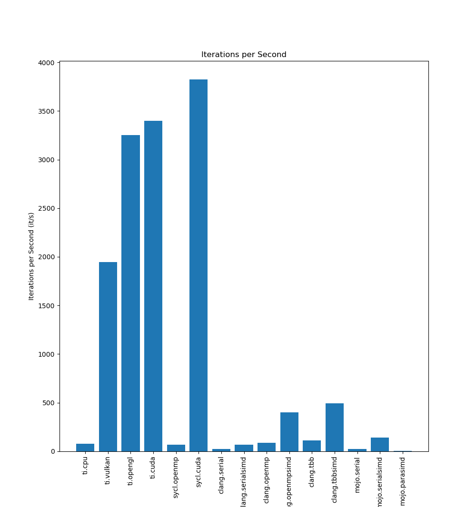

# 网络热门并行编程框架 - 性能测评

目前已经评测过Taichi、SyCL、C++、OpenMP、TBB、Mojo。结果如下：

## 性能测试结果（越高越好）



## 我的结论

1. SyCL 的 CUDA 后端能达到接近原生 CUDA 的性能，Taichi 的 CUDA 后端也是，但是考虑到 SyCL 能够支持 shared memory 等重要 GPU 特性（而且同样是跨平台跨硬件的，也能 fallback 到 CPU），而 Taichi 只能支持纯纯的 parallel for，再没有对硬件底层细节任何细粒度控制了，诸如 scan 和 histogram 等常用并行算法，并不是纯粹的 parallel for 能够实现的，如果用 atomic 那么效率会非常低下，SyCL 暴露了 shared memory 控制，只要稍微动动手，就可以在这些非平凡的并行算法上完全吊打 Taichi。
2. 可以看到，小彭老师负责研发的 OpenGL compute shader 后端性能比肩 CUDA（同样运行在 NVIDIA 显卡上），吊打当后炸子鸡 Vulkan 后端（是不是 Vulkan 没识别到 NVIDIA 显卡？如果不是，那么只能解释为 Vulkan 后端的作者实现的有问题，例如优化 pass 失效，造成了额外的拷贝等等）。
3. Taichi 的 CPU 后端似乎没有用 SIMD 优化，被小彭老师用 experimental/simd 手动优化过的 clang.tbbsimd 吊打。
4. Taichi 的 CPU 后端，其多线程并行效率也不如 TBB，推测可能 Taichi 内部使用了静态任务分发，而 TBB 具有任务队列和线程池，能够自动适应具有动态负载的 Mandelbrot 计算任务（TBB 这种动态分发应该也比较适合大小核的情况）。
5. Mojo 的 SIMD 类还是有点东西的，和 C++ 目前缺失 simd_mask 的 simd_cast 功能的 experimental/simd 相比优化得更好，同时单方面吊打完全没有 SIMD 优化的 Taichi。
6. 疑问，Mojo 的并行版本为什么比串行还慢很多，是我的使用方法有问题吗？明明用的就是官方 Jupyter 里的那个代码案例。
7. Mojo 语言没有用户和生态基础，看得出这波骰子人确实很急于变现，想蹭波 AI 流量，以高性能为噱头，结果一看又**不支持 GPU，就是纯 CPU 的 SIMD 加速**；静态类型，试图模仿 C++ 的同时又试图讨好 Python 转移过来的用户，没有 C++/CUDA 的高性能生态，语法上又不如 Python 简洁灵活，这是否有点……（吴京 U 形锁.jpg）事实上 Python 的胶水作用已经足够好了，Python 低效无所谓，反正真正的大计算都是封装好在 C++ 库里的，总之，Python 调用 C++/CUDA 的 kernel 才是今后不论科学计算还是神经学习的主流。
8. Taichi 的对并行的理解，可以说是极其幼稚了，他只支持的 parallel for，最多也只能在编译器的识别到的情况下自动优化个简单的 parallel reduce。而 histogram、scatter、gather、prefix scan、radix sort、bvh traversal、transpose、gemm、fft 等种种并行算法得以高效的秘诀，都需要对硬件细粒度的控制，特别是 shm。而我们天真的 Taichi 似乎以为“并行就是 parallel for”，拒绝暴露出 `__syncthreads`、`__shared__`、`cudaStream_t`、`texture` 等所谓“对小白不友好”的 CUDA 特性，而这些恰恰又是实现很多非平凡的并行算法的关键。举个例子，如果没有 `__shared__`，那么你只能基于 `atomicAdd` 去在全局内存中累积 histogram，那是极其低效的。SyCL 中的概念大多和一一对应，例如 work-group 对应 block，sub-group 对应 wrap，且这些概念在 AMD 等其他显卡上也有对应，只不过术语不同。而你 Taichi 明明运行在 NVIDIA 显卡上，却以“不想劝退小白”的政治原因为由，不暴露 shared memory 的控制权给用户，似乎土木老哥只想要个并行 for 就走遍天下了，还专门加了个编译器 pass 去检测 reduce 的行为并转换成 BLS，然而又不是所有的并行算法都是 reduce 呀？我 scan 也需要 BLS 你为什么不支持呢？索性暴露出 shared memory 控制接口给用户让他们自己决定多好？为了个所谓的“简洁”理念，逼的用户要排个序还的先导出到 CPU 端来用 numpy.sort 排序完了在导回 GPU 侧，仅仅只是因为他们不提供 shared memory 接口（即使能够不用 shared memory 的情况下强行实现 radix sort 其效率也不敌 CPU 快速排序）。这多少有点“苹果喜欢教用户做事”行为，而且我寻思着你们引入的 sparse 和 autodiff 特性也并不“对小白友好”呀？

# 原始测试结果

## 基准测试平台

- 类型：笔记本，长时间插电
- 处理器：Intel(R) Core(TM) i7-9750H CPU @ 2.60GHz
- 架构：64 位 x86，支持 AVX2，不支持 AVX512
- 核心数量：6 核 12 线程
- L1 指令缓存：32 KB x 6
- L1 数据缓存：32 KB x 6
- L2 缓存：256 KB x 6
- L3 缓存：12 MB
- 内存：DDR4，32 GB（由两块 16 GB 组成）
- 内存带宽：64 位 x 2 x 2667 MT/s（理论上限 41.67 GB/s）
- 显卡：GeForce RTX 2080 Mobile（显存 8 GB）

## Taichi

```bash
python ti_mandel.py
```

```
[Taichi] version 1.6.0, llvm 15.0.4, commit f1c6fbbd, linux, python 3.11.3
[Taichi] Starting on arch=x64
'cpu': 100%|██████████████████████████████████████████████████████████████████████████████████████████████████| 40/40 [00:00<00:00, 79.20it/s]
[Taichi] version 1.6.0, llvm 15.0.4, commit f1c6fbbd, linux, python 3.11.3
[Taichi] Starting on arch=vulkan
'vulkan': 100%|█████████████████████████████████████████████████████████████████████████████████████████| 1000/1000 [00:00<00:00, 1946.08it/s]
[Taichi] version 1.6.0, llvm 15.0.4, commit f1c6fbbd, linux, python 3.11.3
[Taichi] Starting on arch=opengl
'opengl': 100%|█████████████████████████████████████████████████████████████████████████████████████████| 1000/1000 [00:00<00:00, 3250.63it/s]
[Taichi] version 1.6.0, llvm 15.0.4, commit f1c6fbbd, linux, python 3.11.3
[Taichi] Starting on arch=cuda
'cuda': 100%|███████████████████████████████████████████████████████████████████████████████████████████| 1000/1000 [00:00<00:00, 3399.18it/s]
```

## SyCL (OpenSYCL)

```bash
syclcc -ltbb -fopenmp -fopenmp-simd -march=native -O3 --opensycl-targets="omp.accelerated;cuda:sm_75" sycl_mandel.cpp -o /tmp/mandel && /tmp/mandel
```

```
[1/2] Building CXX object CMakeFiles/main.dir/main.cpp.o
clang-15: warning: CUDA version is newer than the latest supported version 11.5 [-Wunknown-cuda-version]
[2/2] Linking CXX executable main
cpu: 100 次 1.458643 秒 68.556863 次每秒
gpu: 1000 次 0.261486 秒 3824.293976 次每秒
```

> 其中 cpu 为 OpenMP 后端，gpu 为 CUDA 后端。

## C++ (Clang)

```bash
clang++ -std=c++17 -ltbb -fopenmp -fopenmp-simd -march=native -O3 cpp_mandel.cpp -o /tmp/mandel && /tmp/mandel
```

```
serial: 100 次 4.690524 秒 21.319580 次每秒
serial+simd: 100 次 1.455435 秒 68.707992 次每秒
openmp: 100 次 1.132339 秒 88.312781 次每秒
openmp+simd: 100 次 0.249237 秒 401.224916 次每秒
tbb: 100 次 0.903358 秒 110.698104 次每秒
tbb+simd: 100 次 0.203668 秒 490.996253 次每秒
```

## Mojo

由于 Mojo 现在只提供 early access，只能在指定的服务器上访问，因此决定在 Mojo 服务器上编译同款 cpp 代码运行，和服务器上运行的 Mojo 比较。

> 他们服务器的 CPU 型号：Intel(R) Xeon(R) Platinum 8375C CPU @ 2.90GHz

### Mojo 服务器上的 C++ (GCC)

```python
from python import Python
let subprocess = Python.import_module("subprocess")
print(subprocess.check_output(['sh', '-c', 'g++ -std=c++17 -fopenmp -fopenmp-simd -march=native -O3 cpptest.cpp -o /tmp/mandel && /tmp/mandel']).decode())
```

```bash
serial: 100 次 4.834733 秒 20.683666 次每秒
serial+simd: 100 次 1.001713 秒 99.829027 次每秒
openmp: 100 次 0.340752 秒 293.468592 次每秒
openmp+simd: 100 次 0.040117 秒 2492.719079 次每秒
```

## Mojo 服务器上的 Mojo

我们将使用他们服务器上自带的 Mandelbrot.ipynb 作为案例进行测试。

同样也是执行一百次看毫秒数，记得将参数改成和我们其他的实验案例一致：

```
alias xmin: Float32 = 0
alias xmax: Float32 = 1
alias xn = 1024
alias ymin: Float32 = 0
alias ymax: Float32 = 1
alias yn = 1024
alias MAX_ITERS = 50
```

结果：

```
num hardware threads:
32
execution_time nosimd in ms:
4832.1347040000001  # 20.695 it/s
execution_time sequential in ms:
496.86684600000001  # 201.26 it/s
sequential/nosimd speedup:
9.7252105728141096
execution_time parallel in ms:
11751.435301        # 8.5096 it/s 为什么并行的反而更慢了？
parallel/sequential speedup:
0.042281375276577375
```

得到 Mojo 服务器上的结果：

```
mojo.serial 20.60
mojo.serialsimd 201.26
mojo.parasimd 8.51
gcc.serial 20.68
gcc.serial+simd 99.83
gcc.openmp 293.47
gcc.openmp+simd 2492.72
```

结合我自己电脑上的结果进行缩放：

```
mojo.serial 20.60/20.68*21.32
mojo.serialsimd 201.26/99.83*68.71
mojo.parasimd 8.51/2492.72*401.22
clang.serial 21.32
clang.serialsimd 68.71
clang.openmp 88.31
clang.openmpsimd 401.22
```

## 整理成列表

```
ti.cpu 79.20
ti.vulkan 1946.08
ti.opengl 3250.63
ti.cuda 3399.18

sycl.openmp 68.56
sycl.cuda 3824.29

clang.serial 21.32
clang.serialsimd 68.71
clang.openmp 88.31
clang.openmpsimd 401.22
clang.tbb 110.70
clang.tbbsimd 491.00
```
